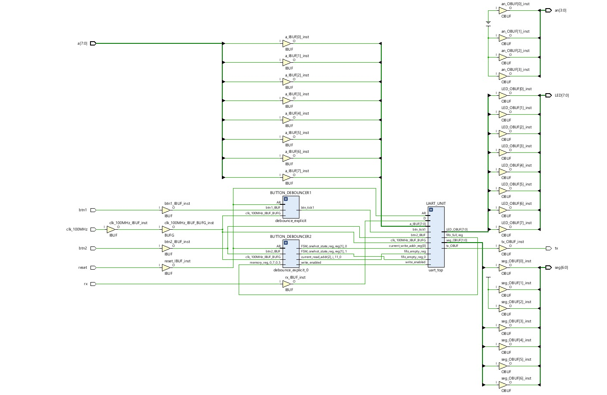
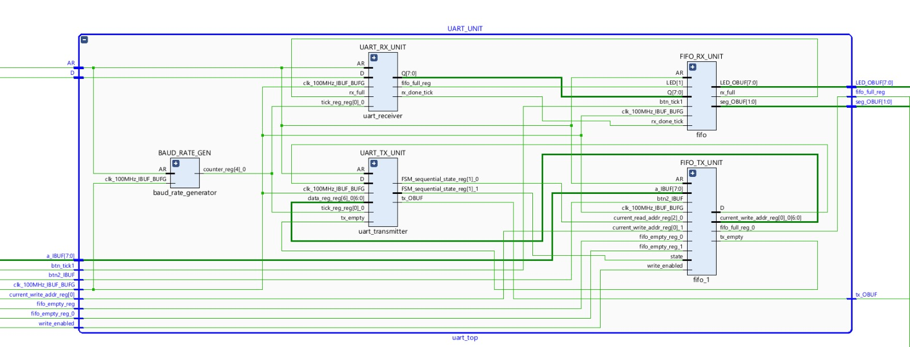
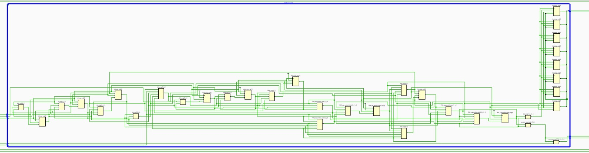
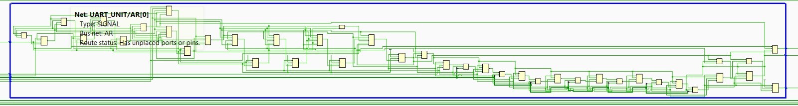
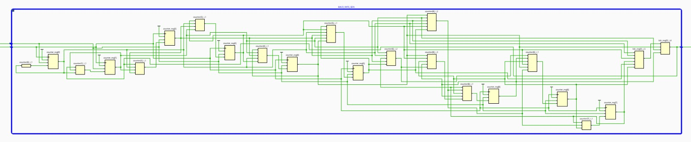
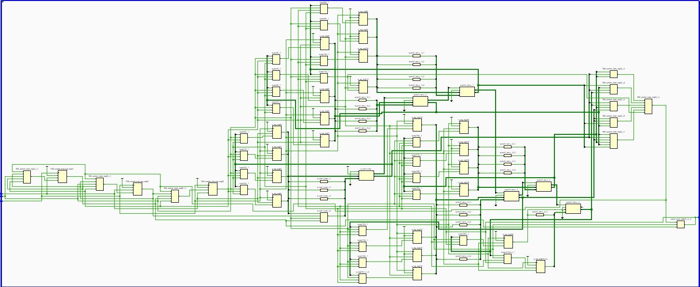
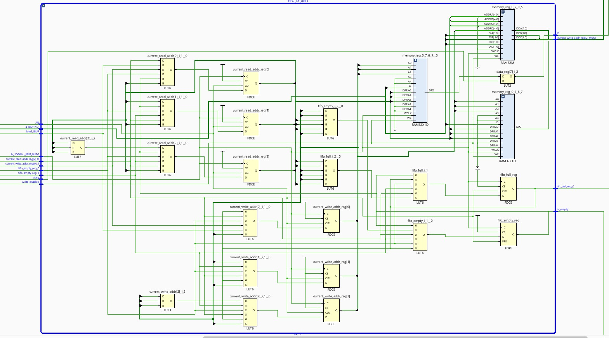
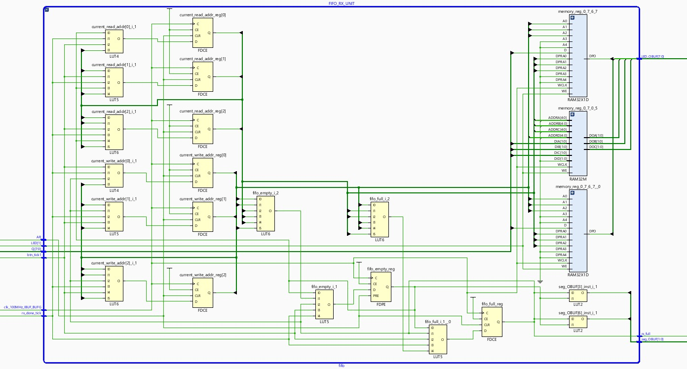
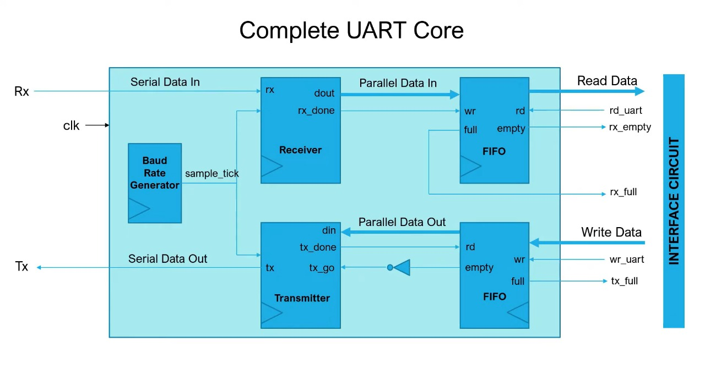

# UART Communication System | FPGA Based

This project implements a **full-duplex UART (Universal Asynchronous Receiver/Transmitter) communication system** using Verilog, designed for FPGA deployment. It supports 8-bit data frames, a configurable baud rate via a clock-derived sampling mechanism, FIFO buffers for asynchronous data handling, and debounced control inputs. The system is verified through simulation to ensure correct serial data transmission.

> **Executive Summary:** A high-performance UART transceiver with FIFO buffering and debounce logic, implemented in Verilog. It facilitates reliable 8-N-1 serial communication with oversampling, featuring separate transmitter and receiver modules, and is verified on an FPGA platform.

---

## Tools and Technologies

- Xilinx Vivado
- puTTY
- Basys3 FPGA (with 100 MHz clock)

---

## Highlights

The UART communication system is organized into modular blocks for clarity and efficiency:

1. **Baud Rate Generator:** Generates a periodic `tick` signal (16× the baud rate) derived from the 100 MHz FPGA clock, enabling precise bit timing.
2. **Debouncer:** Cleans external input signals (e.g., push buttons) to produce single-cycle enable pulses for read/write requests, eliminating glitches.
3. **UART Receiver:** A finite-state machine that detects the start bit, samples incoming serial data on each `tick`, assembles an 8-bit word, and signals when `data_ready`.
4. **UART Transmitter:** A finite-state machine that shifts out a start bit, 8 data bits (LSB first), and a stop bit on the serial `tx` line, asserting `tx_done` when transmission completes.
5. **FIFO Buffers:** Two 8-byte FIFO queues (one for RX, one for TX) decouple asynchronous data flows, preventing data loss during bursts. Status flags (`empty`, `full`) manage buffer flow control.

---

### Error Handling & Flow Control

- **Buffer Overflow Prevention:** The receive FIFO asserts a `full` flag to halt data writes when full, preventing overrun. The transmit FIFO asserts `empty` when no data is available, avoiding underflow.
- **Debounced Controls:** External `read`/`write` requests are synchronized and debounced to avoid multiple triggers from a single button press.
- **Framing:** The design assumes 8-N-1 format (1 start, 8 data, 1 stop bit). No parity checking is implemented (Parity = None), so parity errors are not detected. Framing errors (missing stop bit) are not explicitly flagged.

> **Note:** Back-to-back serial data is managed by the FIFOs, which act as flow-control buffers. Without additional flow control (e.g. RTS/CTS), the system relies on FIFO fullness to handle high data rates.

---

### Supported Configurations

The UART system supports common serial communication parameters:

| **Parameter**      | **Specification**                                            |
|--------------------|--------------------------------------------------------------|
| Baud Rate          | Configurable (e.g. 9600, 19200, 115200 bps) via clock divider|
| Data Bits          | 8 bits (fixed)                                               |
| Parity             | None (no parity checking)                                    |
| Stop Bits          | 1 stop bit                                                   |
| Oversampling Rate  | 16× (16 samples per bit)                                     |
| FIFO Depth         | 8 bytes (per FIFO, from 2^3 address width)                   |
| System Clock       | 100 MHz (FPGA clock)                                         |
| Flow Control       | None (software-managed via FIFO status)                      |

---

## Top-Level Interface

The `uart_top` module exposes the following I/O signals:

| **Signal**         | **Direction** | **Description**                          |
|--------------------|---------------|------------------------------------------|
| `clk_100MHz`       | Input         | 100 MHz system clock                     |
| `reset`            | Input         | Active-high synchronous reset            |
| `read_uart`        | Input         | Pulse to read one byte from RX FIFO      |
| `write_uart`       | Input         | Pulse to write one byte into TX FIFO     |
| `rx`               | Input         | UART serial data input (from external TX)|
| `write_data[7:0]`  | Input         | 8-bit data bus to write into TX FIFO     |
| `rx_full`          | Output        | High when RX FIFO is full (overflow)     |
| `rx_empty`         | Output        | High when RX FIFO is empty (underflow)   |
| `tx`               | Output        | UART serial data output (to external RX) |
| `read_data[7:0]`   | Output        | 8-bit data bus read from RX FIFO         |

---

## Architectural Description

The design is organized into distinct Verilog modules that implement the UART protocol:

- **Baud Rate Generator:** Implements a clock divider (counter) that produces a `tick` signal when it reaches a preset limit (`BR_LIMIT`). This tick is used to oversample the serial line at 16× the baud rate, ensuring accurate bit sampling.
- **Debounce Logic:** Two instances of a debouncer filter noisy push-button signals (`btn1`, `btn2`) into clean single-cycle pulses (`btn_tick1`, `btn_tick2`), which act as `read_uart` and `write_uart` requests.
- **FIFO Buffers:** Two identical FIFO modules (8-byte depth) buffer data asynchronously between the UART and control logic. The **RX FIFO** writes incoming data when `data_ready` is asserted and reads out on `read_uart`. The **TX FIFO** writes external `write_data` on `write_uart` and reads data for transmission when `tx_done` is asserted.
- **UART Receiver (`uart_receiver`):** A finite state machine that waits for the start bit on `rx`, then samples each data bit on the mid-point of its period using the `tick`. After receiving 8 bits and the stop bit, it asserts `data_ready` and outputs the assembled byte (`data_out`).
- **UART Transmitter (`uart_transmitter`):** A finite state machine that, when `tx_start` is true, shifts out a start bit (logic 0), then the 8-bit `data_in` LSB first, and finally a stop bit (logic 1). A `tx_done` flag is asserted after the stop bit. The `tx_start` signal is driven by the inverted `empty` flag of the TX FIFO (i.e., start when data is available).
- **Top-Level Module (`uart_top`):** Instantiates the above blocks. It routes the FPGA clock and reset to each unit, connects the `tick` from the baud generator to both UART Rx/Tx for timing, and ties FIFO control signals together. The transmitter reads from the TX FIFO and drives the `tx` line; the receiver writes to the RX FIFO and provides data on `read_data` when requested.

---

## Testing and Netlist Visualization

### Functional Testing

- Each module of the design was individually verified through simulation and step-by-step debugging to ensure functional correctness before system-level integration.

### Netlist Visualization

After synthesis (e.g., in Intel Quartus Prime), the design hierarchy can be viewed:

- **Top-Level View:** Shows the entire UART block connections.  
  
  
      
     <b>Figure:</b> Synthesized top-level UART design.  
  

- **UART Unit:**  
  
  
      
     <b>Figure:</b> UART Unit module architecture.  
  

- **Transmitter Block:**  
  
  
      
     <b>Figure:</b> UART Transmitter module architecture.  
  

- **Receiver Block:**  
  
  
      
     <b>Figure:</b> UART Receiver module architecture.  
  

- **BaudRate Generator:**  
  
  
      
     <b>Figure:</b> Baud Rate Generator module architecture.  
  

- **Debouncer Unit:**  
  
  
      
     <b>Figure:</b> Debouncer module architecture.  
  

- **Transmitter FIFO:**  
  
  
      
     <b>Figure:</b> Transmitter FIFO module architecture.  
  

- **Receiver FIFO:**  
  
  
      
     <b>Figure:</b> Receiver FIFO module architecture.  
  

---

## References

- **Reference UART architecture:** The design concept follows standard asynchronous serial communication patterns (see example below).  
  
  
      
     <b>Figure:</b> Example reference UART block architecture.  
  

---
